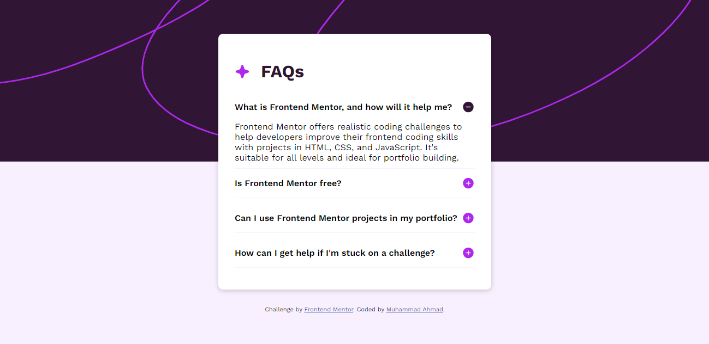
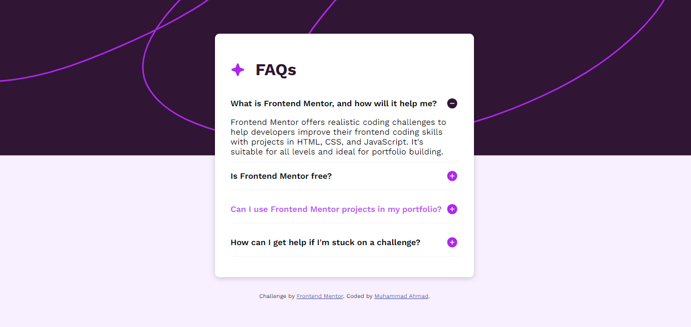

# Frontend Mentor - FAQ accordion solution

This is a solution to the [FAQ accordion challenge on Frontend Mentor](https://www.frontendmentor.io/challenges/faq-accordion-wyfFdeBwBz).

### Screenshot




### Links

- Solution URL: (https://github.com/muhammad-ahmad66/Frontend-Mentor---FAQ-accordion)

### Built with

- Semantic HTML5 markup
- CSS custom properties
- Flexbox
- Desktop-first workflow
- vanilla javascript

To see how you can add code snippets, see below:

```html
<!DOCTYPE html>
<html lang="en">
  <head>
    <meta charset="UTF-8" />
    <meta name="viewport" content="width=device-width, initial-scale=1.0" />
    <!-- displays site properly based on user's device -->

    <link
      rel="icon"
      type="image/png"
      sizes="32x32"
      href="./assets/images/favicon-32x32.png"
    />
    <link rel="stylesheet" href="style.css" />

    <title>Frontend Mentor | FAQ accordion</title>

    <!-- Feel free to remove these styles or customise in your own stylesheet 👍 -->
    <style>
      .attribution {
        font-size: 11px;
        text-align: center;
      }
      .attribution a {
        color: hsl(228, 45%, 44%);
      }
    </style>
  </head>
  <body>
    <div class="faqs-container">
      <div class="faq-head">
        
        <h2>FAQs</h2>
      </div>
      <div class="faq">
        <div class="question-box">
          <p>What is Frontend Mentor, and how will it help me?</p>
          
        </div>
        <p class="answer">
          Frontend Mentor offers realistic coding challenges to help developers
          improve their frontend coding skills with projects in HTML, CSS, and
          JavaScript. It's suitable for all levels and ideal for portfolio
          building.
        </p>
      </div>

      <!-- Q2 -->
      <div class="faq">
        <div class="question-box">
          <p>Is Frontend Mentor free?</p>
          
        </div>
        <p class="answer">
          Yes, Frontend Mentor offers both free and premium coding challenges,
          with the free option providing access to a range of projects suitable
          for all skill levels
        </p>
      </div>

      <!-- Q3 -->
      <div class="faq">
        <div class="question-box">
          <p>Can I use Frontend Mentor projects in my portfolio?</p>
          
        </div>
        <p class="answer">
          Yes, you can use projects completed on Frontend Mentor in your
          portfolio. It's an excellent way to showcase your skills to potential
          employers!
        </p>
      </div>

      <!-- Q4 -->
      <div class="faq">
        <div class="question-box">
          <p>How can I get help if I'm stuck on a challenge?</p>
          
        </div>
        <p class="answer">
          The best place to get help is inside Frontend Mentor's Discord
          community. There's a help channel where you can ask questions and seek
          support from other community members.
        </p>
      </div>
    </div>

    <div class="attribution">
      Challenge by
      <a href="https://www.frontendmentor.io?ref=challenge" target="_blank"
        >Frontend Mentor</a
      >. Coded by
      <a href="https://github.com/muhammad-ahmad66">Muhammad Ahmad</a>.
    </div>

    <script src="script.js"></script>
  </body>
</html>
```

```css
@import url('https://fonts.googleapis.com/css2?family=Work+Sans:wght@400;600;700&display=swap');

:root {
  --color-white: hsl(0, 0%, 100%);
  --color-light-pink: hsl(275, 100%, 97%);
  --color-grayish-pink: hsl(292, 16%, 49%);
  --color-purple: #c05bf0;
  --color-dark-purple: hsl(292, 42%, 14%);
}

* {
  padding: 0;
  margin: 0;
  box-sizing: border-box;
}

html {
  font-size: 62.5%;
}

body {
  padding: 2rem 2rem;
  min-height: 100vh;
  width: 100%;
  background: url('/assets/images/background-pattern-desktop.svg');
  background-color: var(--color-light-pink);
  /* background-position: bottom; */
  background-repeat: no-repeat;
  background-size: contain;
  font-family: 'work sans', sans-serif;

  display: flex;
  flex-direction: column;
  gap: 3rem;
  align-items: center;
  justify-content: center;
}

.faqs-container {
  max-width: 50rem;
  background-color: var(--color-white);
  padding: 3rem;
  border-radius: 0.9rem;
  box-shadow: 0 2px 10px 0 rgba(0, 0, 0, 0.2);
}

.faq-head {
  display: flex;
  align-items: center;
  gap: 2rem;
  padding: 2rem 0;
}

.faq-head img {
  width: 2.8rem;
}

.faq-head h2 {
  font-size: 3.2rem;
  color: var(--color-dark-purple);
}
.faq {
  display: flex;
  flex-direction: column;
  /* gap: 10px; */
}
.question-box {
  display: flex;
  align-items: center;
  justify-content: space-between;
  padding: 1.4rem 0;
  cursor: pointer;
  font-size: 1.6rem;
  font-weight: 600;
}
/* &:not(:last-child) */
.question-box:not(:last-child) {
  border-bottom: 1px solid var(--color-light-pink);
}

.question-box:focus,
.question-box:hover {
  color: var(--color-purple);
}

.question-box img {
  width: 2.4rem;
}

.answer {
  max-height: 0;
  visibility: hidden;
  opacity: 0;
  transition: all 0.4s ease-in;
  padding: 0 0 10px 0;
  font-size: 1.6rem;
}

.active .answer {
  max-height: 20rem;
  visibility: visible;
  opacity: 1;
}

/* FOR MOBILE [< 600px]  */
@media only screen and (max-width: 37.5em) {
  html {
    font-size: 50.5%;
  }

  body {
    background: url('/assets/images/background-pattern-mobile.svg');
    /* background-position: bottom; */
    background-repeat: no-repeat;
    background-size: contain;
  }
}
```

```js
const qs = document.querySelectorAll('.question-box');
const faqBox = document.querySelector('.faqs-container');

let r = document.querySelector(':root');
const rStyle = getComputedStyle(r);
let colorLightPink = rStyle.getPropertyValue('--color-light-pink');

function handler(e) {
  // Selecting question box
  const q = e.target.closest('.question-box');

  // if (!q) return;
  if (!q) return;
  // Toggle the active class
  q.parentElement.classList.toggle('active');

  // Remove border from question box
  if (q.parentElement.classList.contains('active')) {
    q.style.borderBottom = 0;
    q.nextElementSibling.style.borderBottom = `1px solid ${colorLightPink}`;
  } else {
    q.style.borderBottom = `1px solid ${colorLightPink}`;
  }

  // changing the icon
  const icon = q.querySelector('#icon');

  const i = icon.src.split('-');
  // console.log(iconPlus);

  if (i[1] === 'plus.svg') {
    icon.src = `/assets/images/icon-minus.svg`;
  } else {
    icon.src = `/assets/images/icon-plus.svg`;
  }
}

faqBox.addEventListener('click', handler);
```

## Author

- Website - [Muhammad Ahmad]
- Frontend Mentor - [@muhammad-ahmad66](https://www.frontendmentor.io/profile/muhammad-ahmad66)
